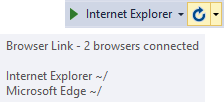
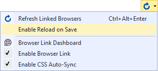
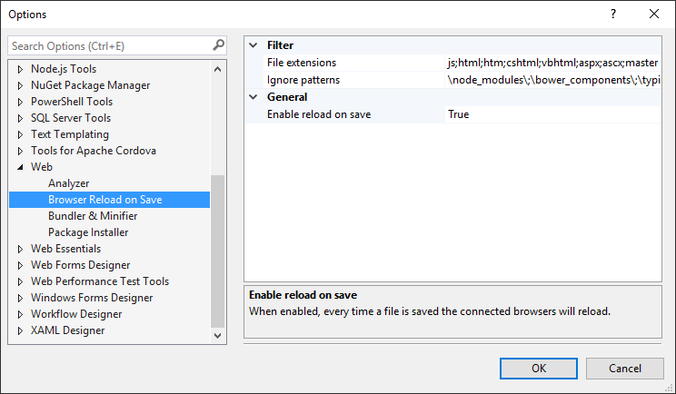

# Browser Reload on save

Download the extension at the
[VS Gallery](https://visualstudiogallery.msdn.microsoft.com/46eef4d9-045b-4596-bd7f-eee980bb5450)
or get the
[CI build](http://vsixgallery.com/extension/2d8aa02a-8810-421f-97b9-86efc573fea3/)

------------------------------------------

A Visual Studio extension for ASP.NET projects that
leverages Browser Link to to reload all connected browsers
when files are saved in Visual Studio.

## Connect with Browser Link

For this extension to work, make sure that Visual Studio's
Browser Link is up and running. Do that by running an
ASP.NET application from Visual Studio in one or more
browsers.

Hovering over the Browser Link button on the Standard
toolbar lets you know if Browser Link is connected.

## Reload on save
Every time a file in the project directory is saved, all the
connected browsers will be reloaded. The files doesn't have
to be modified in Visual Studio for the reload to occur. As
long as the file changed on disk, the reload happens. 

This makes it work really well with other tools and extnsions
that modify files.

There are settings that lets you control what file names will
trigger the reload and what global folder names to ignore.

## Settings
The settings can be found at
**Tools -> Options -> Web -> Browser Reload on Save**

You can disable this extension very easily from the Browser
Link dropdown on the Standard toolbar.

This will disable reload for all project in the solution.

## Contribute
Check out the [contribution guidelines](CONTRIBUTION.md)
if you want to contribute to this project.

For cloning and building this project yourself, make sure 
to install the
[Extensibility Tools 2015](https://visualstudiogallery.msdn.microsoft.com/ab39a092-1343-46e2-b0f1-6a3f91155aa6)
extension for Visual Studio which enables some features
used by this project.

## License
[Apache 2.0](LICENSE) 